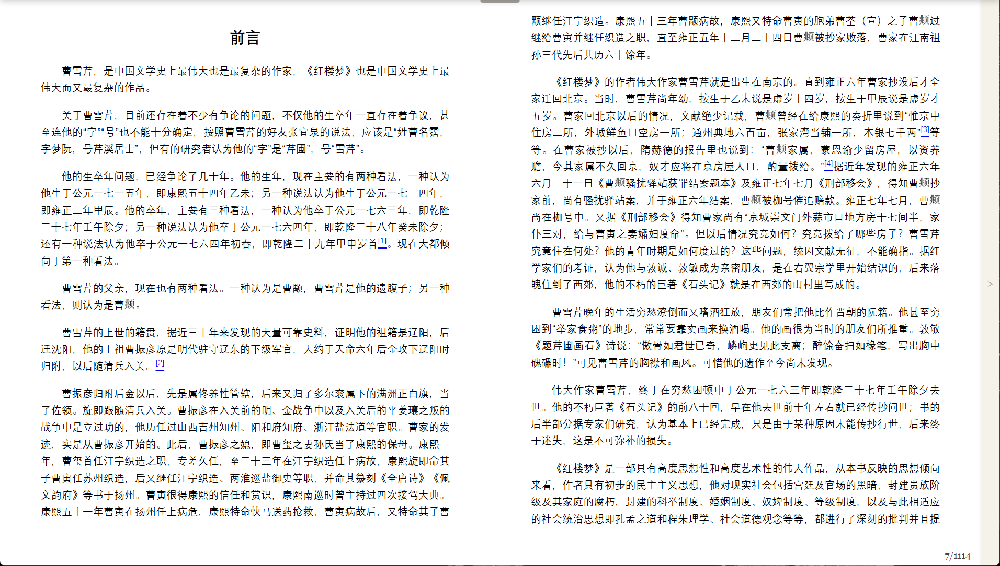

# BookBlue

BookBlue是一个基于Web的EPUB电子书阅读器，提供简洁的阅读体验和Dropbox集成，让您可以在任何设备上享受无缝的阅读体验。



## 功能特点

### 核心阅读功能
- 📚 支持EPUB格式电子书
- 📖 流畅的分页阅读体验
- 🔖 自动保存阅读进度
- 📝 集成笔记功能

### Dropbox集成
- 🔄 连接Dropbox账户访问您的电子书
- ☁️ 在云端保存阅读进度
- 📱 多设备间同步阅读位置
- 📤 上传新书到Dropbox

### 用户体验
- 🖱️ 支持鼠标滚轮、键盘箭头键和触摸屏操作
- 📊 显示阅读进度和位置信息
- 🎨 简洁优雅的界面设计
- 📱 响应式设计，适配不同屏幕尺寸

## 快速开始

### 在线使用
访问 [BookBlue在线版](https://Xuperbad.github.io/BookBlue) 立即开始使用。

### 本地部署
1. 克隆仓库
   ```bash
   git clone https://github.com/Xuperbad/BookBlue.git
   cd BookBlue
   ```

2. 使用本地服务器运行
   您可以使用任何静态文件服务器，例如：

   使用Python:
   ```bash
   # Python 3
   python -m http.server

   # Python 2
   python -m SimpleHTTPServer
   ```

   或使用Node.js的http-server:
   ```bash
   npx http-server
   ```

3. 在浏览器中访问 `http://localhost:8000` 或服务器显示的URL

## 使用指南

### 加载电子书
- **拖放方式**: 直接将EPUB文件拖放到阅读区域
- **文件选择**: 点击界面中的"+"按钮选择EPUB文件
- **Dropbox**: 连接Dropbox后，从顶部抽屉中选择已保存的电子书

### 阅读控制
- **翻页**: 使用左右箭头键、鼠标滚轮或触摸屏左右滑动
- **笔记**: 点击右侧边栏展开笔记区域，记录您的想法
- **进度**: 页面底部显示当前阅读进度

### Dropbox连接
1. 点击顶部抽屉中的"连接至Dropbox"按钮
2. 在Dropbox授权页面登录并授权BookBlue
3. 授权成功后，您可以访问Dropbox中的电子书并同步阅读进度

## 技术实现

BookBlue使用纯前端技术构建，主要包括：

- **HTML5/CSS3/JavaScript**: 核心开发语言
- **ePub.js**: 处理EPUB文件的解析和渲染
- **Dropbox API**: 实现云存储和同步功能
- **LocalStorage**: 本地保存阅读进度和笔记

## 隐私说明

BookBlue尊重您的隐私：

- 所有数据仅存储在您的浏览器本地存储或您的Dropbox账户中
- 不收集任何个人信息或阅读习惯数据
- 不包含任何跟踪或分析代码

## 自定义配置

### Dropbox应用设置
如果您想部署自己的版本，需要在Dropbox开发者控制台创建应用并更新以下配置：

1. 在 [Dropbox开发者控制台](https://www.dropbox.com/developers/apps) 创建应用
2. 设置重定向URI为您的部署URL
3. 在代码中更新Dropbox配置（index.html中的dropboxConfig对象）:
   ```javascript
   const dropboxConfig = {
     clientId: '您的Dropbox应用密钥',
     clientSecret: '您的Dropbox应用密钥对应的密钥',
     // 重定向URI会自动使用当前页面URL
   };
   ```

## 贡献指南

欢迎贡献代码或提出建议！请遵循以下步骤：

1. Fork本仓库
2. 创建您的特性分支 (`git checkout -b feature/AmazingFeature`)
3. 提交您的更改 (`git commit -m 'Add some AmazingFeature'`)
4. 推送到分支 (`git push origin feature/AmazingFeature`)
5. 开启Pull Request

## 许可证

本项目采用专有许可证 - 未经明确授权，禁止使用、复制或分发。详情请参阅 [LICENSE](LICENSE) 文件。

如需使用本软件，请通过下方联系方式获取授权。

## 联系方式

如有问题或建议，请通过以下方式联系：

- 项目GitHub Issues: [https://github.com/your-github-username/BookBlue/issues](https://github.com/your-github-username/BookBlue/issues)
- 电子邮件: whiskycyc@gmail.com

---

**BookBlue** - 让阅读更简单，更美好。
